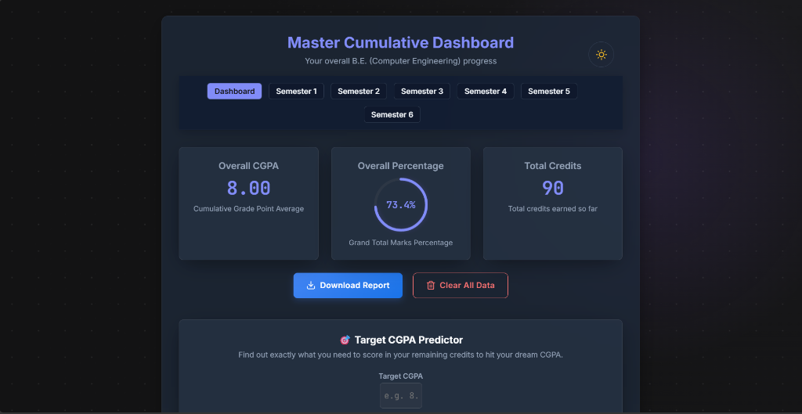
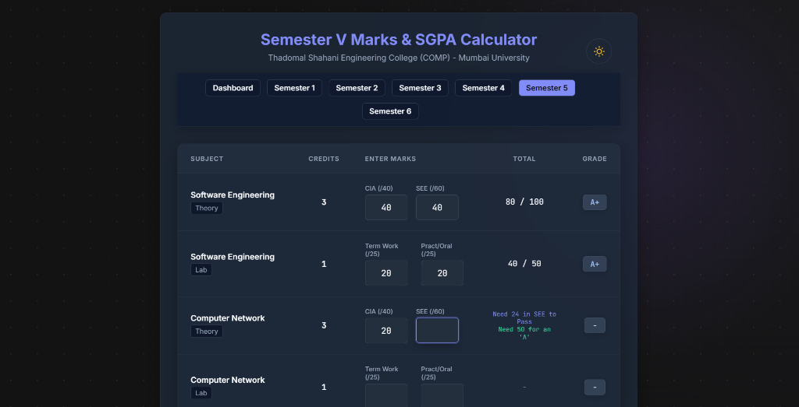
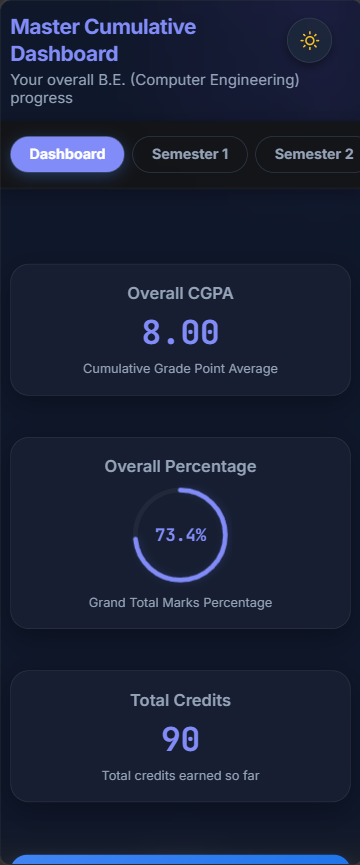

# 🎓 Master CGPA Calculator & Dashboard


A modern, highly responsive, client-side CGPA calculator built specifically for engineering students. It goes beyond simple calculations by offering an interactive master dashboard, dynamic "What-If" grade targeting, and secure cross-device data syncing.

🔗 **[Live Demo](https://cgpa-calculator-sankait45.vercel.app/)**

---

## ✨ Features

- **📊 Master Dashboard:** Automatically aggregates data across all completed semesters to provide a bird's-eye view of your overall CGPA, total credits, and total percentage.
- **🎯 "What-If" Target Predictor:** Input your dream CGPA and total degree credits. The app mathematically calculates exactly what SGPA you need in your remaining semesters to hit your goal.
- **💾 Secure Backup & Sync (JSON):** Export your progress securely to a JSON file and import it on any other device. Includes a silent auto-backup safety layer, corrupted-file rejection, and XSS immunity.
- **📱 Ultra-Responsive UI:** Custom-engineered CSS breakpoints ensure a flawless, app-like experience on screens as small as 320px (iPhone SE size).
- **🖨️ Print-Ready Reports:** Hit `Ctrl + P` to generate clean, distraction-free PDF reports of your grades (navigation bars and buttons automatically hide).
- **🌓 Dark/Light Mode:** Full theme toggling with system-preference detection.

## 📸 Screenshots


| Dashboard View | Semester Entry View | Mobile View (320px) |
| :---: | :---: | :---: |
|  |  |  |

## 🛠️ Tech Stack

This project was intentionally built using a **Zero-Dependency Vanilla Stack** to maximize performance, ensure instant load times, and demonstrate strong foundational web development skills.

- **Frontend:** HTML5, Custom CSS3 (Flexbox/Grid/Variables), Vanilla JavaScript (ES6+)
- **Storage:** Browser `localStorage` & File API (JSON parsing)
- **Testing:** Node.js (Built-in `node:test` framework + JSDOM)

## 🚀 How to Run Locally

Because this project is built with Vanilla web technologies, you don't need any complex build steps to view the app!

1. Clone the repository:
   ```bash
   git clone https://github.com/Sankait45/CGPA-Calculator.git
   ```
2. Navigate to the project directory:
   ```bash
   cd CGPA-Calculator
   ```
3. Open `dashboard.html` directly in your browser, or use an extension like VS Code Live Server.

## 🧪 Automated Test Suite

To ensure absolute mathematical accuracy for floating-point calculations and edge-case grade boundaries, this project includes a robust automated test suite. 

The suite runs 26 independent tests covering SGPA/CGPA logic, impossible predictor targets, division by zero, and input validation.

To run the tests:
1. Ensure you have [Node.js](https://nodejs.org/) installed.
2. Install the testing dependencies:
   ```bash
   npm install
   ```
3. Run the test suite:
   ```bash
   npm test
   ```

## 🤝 Contributing

Contributions, issues, and feature requests are welcome! Feel free to check the [issues page](https://github.com/Sankait45/CGPA-Calculator/issues).

1. Fork the Project
2. Create your Feature Branch (`git checkout -b feature/AmazingFeature`)
3. Commit your Changes (`git commit -m 'feat: Add some AmazingFeature'`)
4. Push to the Branch (`git push origin feature/AmazingFeature`)
5. Open a Pull Request

---
*Designed & Developed by [Sankait45](https://github.com/Sankait45)*
